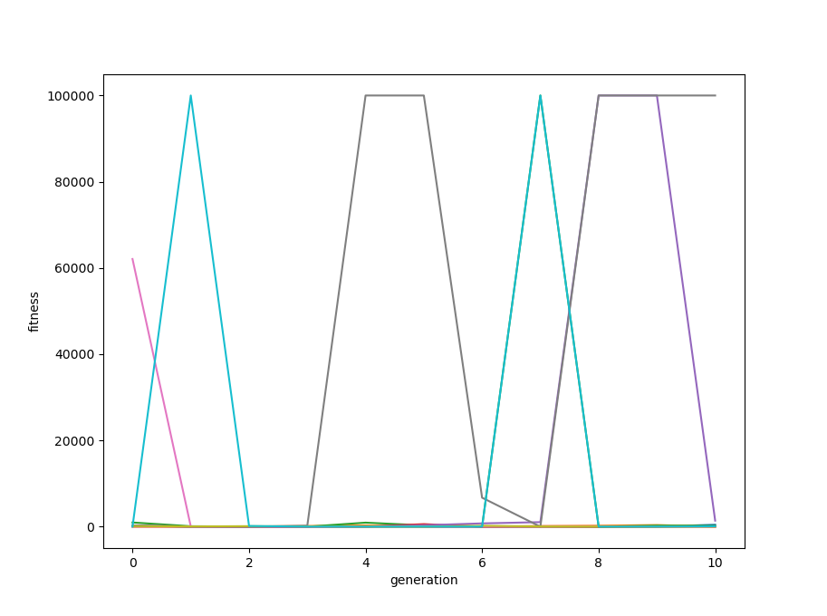

# NEAT python implementation
## What is NEAT?
NEAT means NeuroEvolution of Augmenting Topologies.
See here. [NeuroEvolution of Augmenting Topologies](http://nn.cs.utexas.edu/downloads/papers/stanley.ec02.pdf)

## Run the code
Use `python main.py` to run the code. The code will output current epoch activation computing process, generation info, each species' best genome's fitness, highest fitness record.  
The output will look like this.

> the code needs numpy and python >= 3.5 to run

## Performance
> tested on cart pole balancing experiment

10 Tries in 10 generations:

4 single tries:

some of the best networks:

## What is implemented?
### Class Neat (neat.py)
Contain parameter used by other classes like the population size, mutation power, compatibility threshold, etc.
### Class Population (population.py)
Class Population contains the implementation of population, it can spawn and evolve by epoch.
* spawn function
  * All genomes are contained in one population. When the algorithm starts, a genome is used to mutate and initiate the population generation No.1.
* speciate function
  * After genomes are spawned in population, the population will split the genomes into different species based on their compatibility.
* epoch function
  * The population is evolved through epoch, before the population epoch every genome's fitness is calculated by activation function. In the epoch, old genomes will mutate and mate and generate babies. Babies will be divided into an existing or new species based on compatibility. Good genomes will have more chances to produce babies, the chances are stolen from bad genomes.
### Class Species (species.py)
Class Species is the implementation of species. It includes creating new species, adding genome to species, removing genome to species, calculating species fitness, counting species offspring and reproducing the species.
* adjust_fitness function
  * In the algorithm, each genome's fitness can be boost or drawback by its age, then all genomes are sorted by fitness, genomes sorted before the survival threshold will be able to produce offspring, genomes sorted behind the threshold will be eliminated
* reproduce function
  * The reproduce process of the species, the species' expected offspring number is decided in population epoch. The function creates the offsprings by cloning the champion, mutating the champion of random choosing two genomes in species to mate and mutate. After babies are created, they are sent to species based on compatibility. If no species is found for the baby, a new species will be created.

### Class Genome (genome.py)
Class Genome contains the genome encoding implementation, each genome contains a nodes list and a genes list. I only implemented three mutation ways: mutation link weight, mutation add link and mutation add node. It also includes activation function, mating function and compatibility calculation function. A new genome can be created by create_genome_full_connect or mating or copying.
* create_genome_full_connect function
  * This function is used to create the very first genome when the algorithm starts. It creates a full connect network's genome base on input nodes number, hidden nodes number and output nodes number.
* mutate_link_weights function
  *  This function mutates the weight of every gene in the genome. The amount of mutation is decided by `np.random.normal(-1,1)` multiply by `power`. 
* mutate_add_link function
  *  This function add link to the genome by random choosing two nodes. The out node can't be an input node, and the link shouldn't repeat. Whether to add a recurrent link is decided randomly. There is an iterate recurrent detect function to check if a link is recurrent. There is also max tries for the function to find a suitable new link.
*  mutate_add_node function
   *   Randomly select a gene in the genome, break the gene and add node in the middle, then create two new genes to connect the old gene's input to the new node and the new node to the old gene's output.
* activate function
  *  This function computes the incoming activation sum of each node, and active the node base on sigmoid activation function.
*  compatibility function
   *  Compute the compatibility between two genome, it has two pointers moving through two genome's gene, if the genes' innovation numbers match, the number matching plus one; if the genes' innovation numbers don't match, the number disjoint plus one; if two genes' length doesn't match, the number excess is their length difference. Compatibility is then computed through these three numbers multiply a coefficient.
*  mate_multipoint function
   *  The mating function for genomes. It has two pointers go through the mom's genes and dad's genes. If mom and dad's genes match, create the same gene. If they don't match, select the gene with lower innovation number or randomly select one. Then add gene's input output nodes to the new genome.

### Class Node (node.py)
Node class contains the implementation of node encoding. Each node has a nodeId and nodeType. Nodetype can be "input" "hidden" or "output". Each node has a incomingList and a outcomingList, recording every gene it is connected to. It also has activation numbers that are used in activation function. 

### Class Gene (gene.py)
Gene class contains the implementation of gene encoding. A gene connects two nodes. It has a weight for activation. I didn't implement id for genes. Each gene is recognized by it's inNodeId and outNodeId. And the recurrent flag records whether it is a forward link or a recurrent link.

### Class Innovation (innovation.py)
A innovation instance contains the innovation type ("node" or "link"), the innovation number (if innovation type is a node, innovation need two number for the two links that connected to the node), the new node id (if innovation is a node), the in node id and out node id (if innovation is a link) and old innovation number (if innovation type is a node, the replaced gene's innovation number is stored in old innovation number)

> Class Organism and Class Trait are not implemented because lack of time

### main.py
`main.py` is the entrance of the program. It also contains the pole balancing testing code. It will automatically generate an input=5 output=2 genome and create a population with the genome, then use the population to run pole balance test, then call `population.epoch()` to evolve the population.

